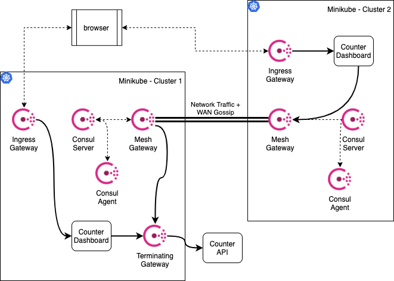
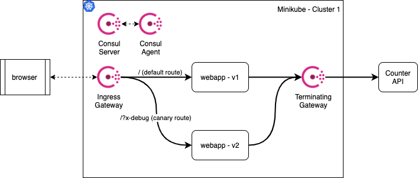
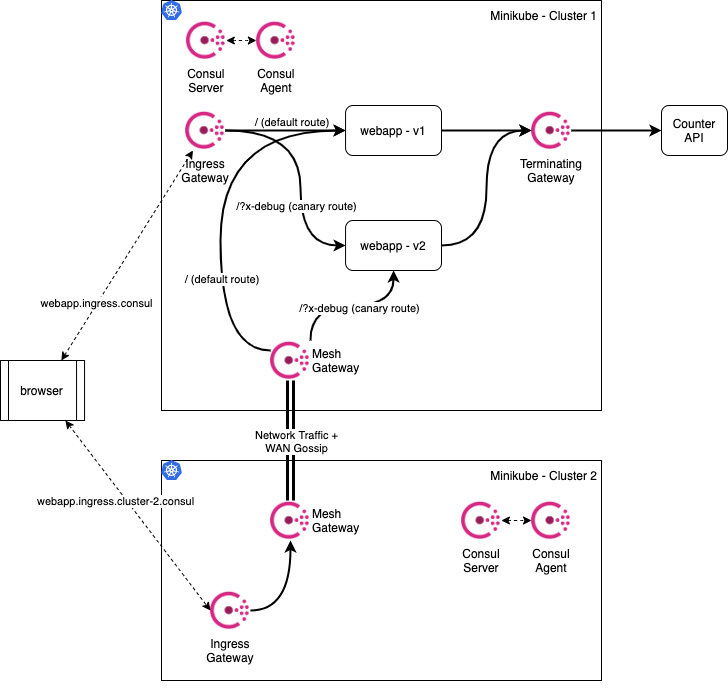
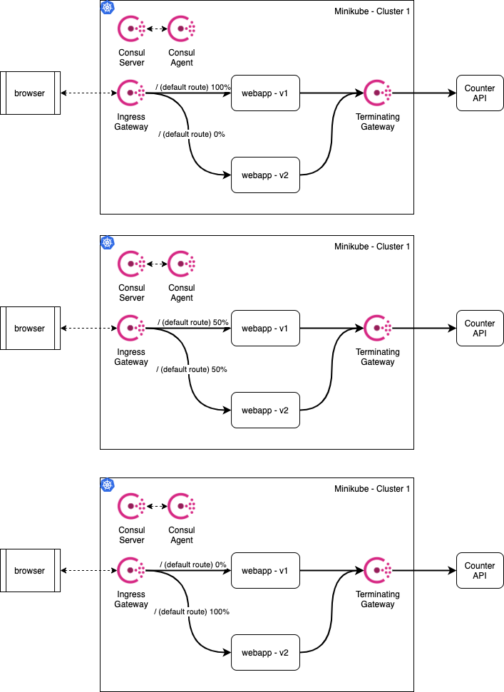

# Local Consul Demos

*Please READ the Requirements section!*

## Overview

The objective of this repo is to display the possibilities of the different Consul gateways in a kubernetes environments

The steps are based in the fantastic work done at https://learn.hashicorp.com/consul/kubernetes/mesh-gateways

For more information, please visit https://www.consul.io/docs/connect/gateways/wan-federation-via-mesh-gateways


## Requirements

I only tested this demo on macOS X with the Consul Enterprise version. There is no reason for this demo to not be able to use Consul OSS.

1. kubectl
2. minikube
3. helm3
4. docker-compose
5. Consul 1.8.0+ cli installed on your machine
6. an internet connection...

### Using Consul Enterprise
For **Consul Enterprise**, please install the license, in **line 66 and 67 of `01_setup.sh`**

### Using Consul OSS
You need to edit the files `values1.yaml` and `values2.yaml`, by removing the specified container images

## Setup

This will use the Mesh Gateway to federate the clusters, install an application, for the gateway to forward the traffic.

To start this demo, follow:

1. `./00_start.sh` will:
   1. start 2 minikube clusters
   2. build 2 versions of the demo "webapp" within each minikube.
2. `./01_setup.sh` will:
   1. Install Consul in both clusters
   2. Federate them using the Mesh Gateway
   3. Deploy the dashboard and webapp applications in each cluster
   4. Configure Consul intentions, routers, splitters, resolvers, ingress and terminating gateways :-O
   5. Add ingress hosts to your `/etc/hosts`

> At the end of the *setup*, you'll see the address of all exposed services of each cluster:
> * consul-ui
> * dashboard
> * webapp

3. `./02_external_counting.sh` will
   1. Start up the counting services with `docker-compose`
   2. Configure the *external service* in **cluster-1**
   3. Configure the *Terminating Gateway*


**NOTE:** *the values.yaml files are altered to be compatible with minikube and not a recommended production setup*


## Demos
### Mesh Gateways



#### Ingress
The services accessible via each ingress gateway are the dashboard (in eahc cluster) and the webapp

* https://dashboard-service.ingress.cluster-1.consul:30443
* https://dashboard-service.ingress.cluster-2.consul:30443

#### Federation/Mesh gateway
At the end of `01_setup.sh` you can see all the URL to access the Consul UI and navigate between data centers.

If you access the dashboard on **cluster-2** - https://dashboard-service.ingress.cluster-2.consul:30443 - the dashboard service will reach the *external counting service* that is registered in **cluster-1**, via the *mesh gateway*.


#### Terminating gateways
`02_external_counting.sh` explains how this is done and `consul_config/counting-terminating-gateway.hcl` explains the configuration.

### Layer 7

#### Canary


The above image means that https://webapp.ingress.consul:30080 will return `webapp - v1`
Access https://webapp.ingress.consul:30080/?x-debug so you will always get `webapp - v2`

##### Bonus

You can also use the ingress gateway from *Cluster 2* to access the services that exist in *Cluster 1*



The endpoints are:
 - https://webapp.ingress.cluster-2.consul:30080"
 - https://webapp.ingress.cluster-2.consul:30080/?x-debug"

#### Rollout
The rollout process is as follows:



1. Open the file `consul_config/webapp-splitter.hcl` and change the values to the percentages you want.

2. To apply the file run:
```bash
source helper.sh
consul1 "config write" "consul_config/webapp-splitter.hcl"
```

3. Keep refreshing https://webapp.ingress.consul:30080 to see the differences.

4. Repeat with different values

### Quick explanation of the Consul config
#### Resolver

*Service metadata* has been added to see the annotations in the files in `c1_manifests/counting-webapp-v1.yaml` and `c1_manifests/counting-webapp-v2.yaml`.
This allows the filter in `consul_config/webapp-resolver.hcl` to work ad define 2 subsets.

The *Failover* entry means that if the service is not found it should resolve to the `webapp` service in `cluster-1` datacenter, which enables the ingress gateway request in `cluster-2` to be routed to `cluster-1`

#### Router

The service router in `consul_config/webapp-router.hcl` allows the service requests to be routed via the splitter or via the HTTP paramaters.

This is why you get these two ways of acessing the webapp:
 * https://webapp.ingress.consul:30080/
 * https://webapp.ingress.consul:30080/?x-debug

#### Splitter

The service splitter in `consul_config/webapp-splitter.hcl` defines the percentage of requests that goes to each *ServiceSubset* defined in the resolver.

## Teardown
Use `03_teardown.sh` to remove it all from your machine.

